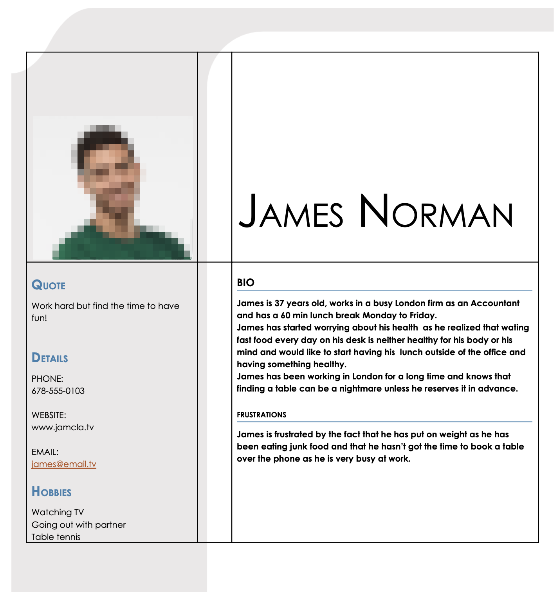
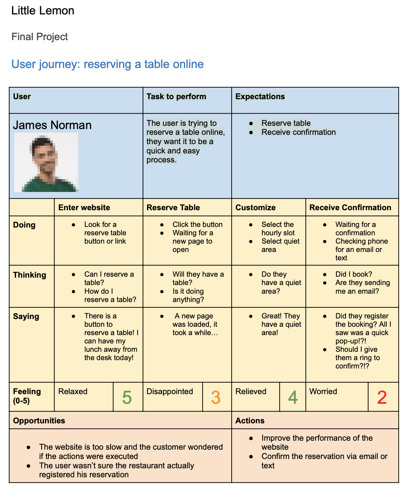
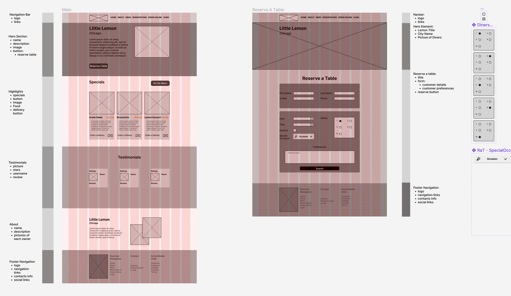
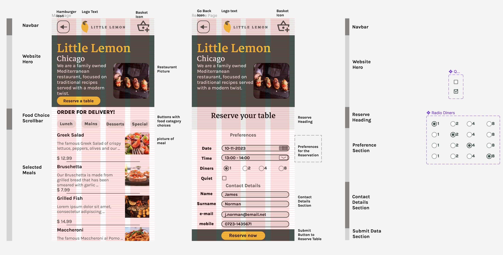
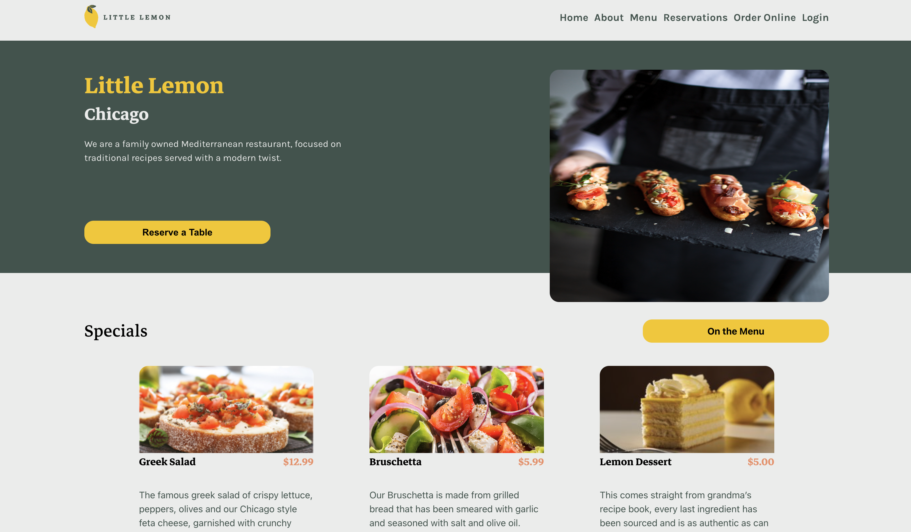
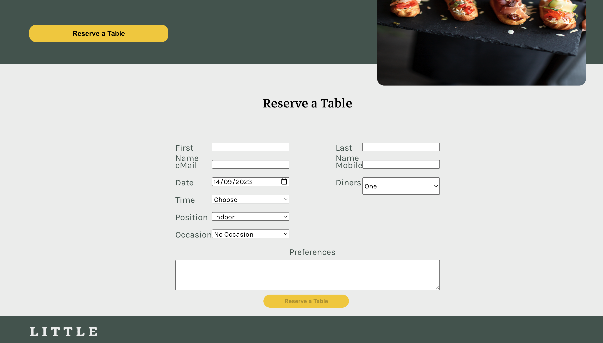
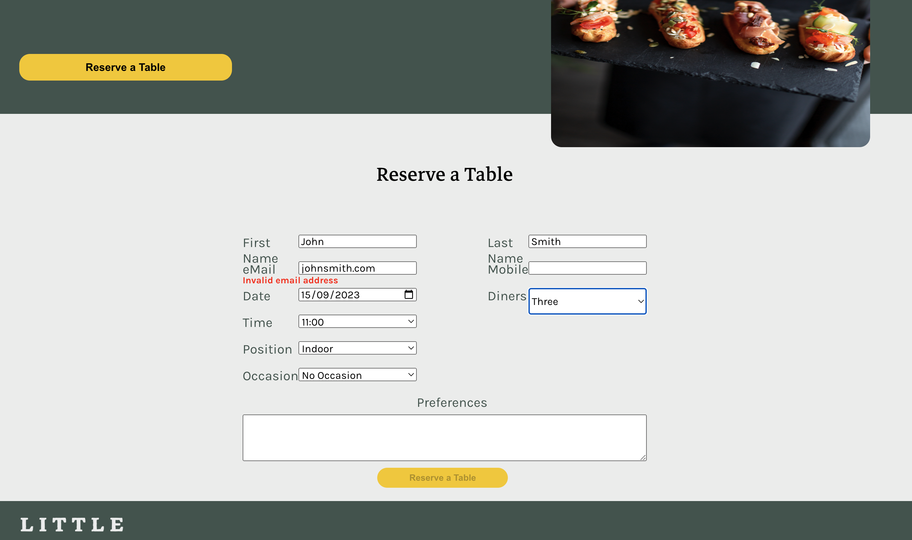
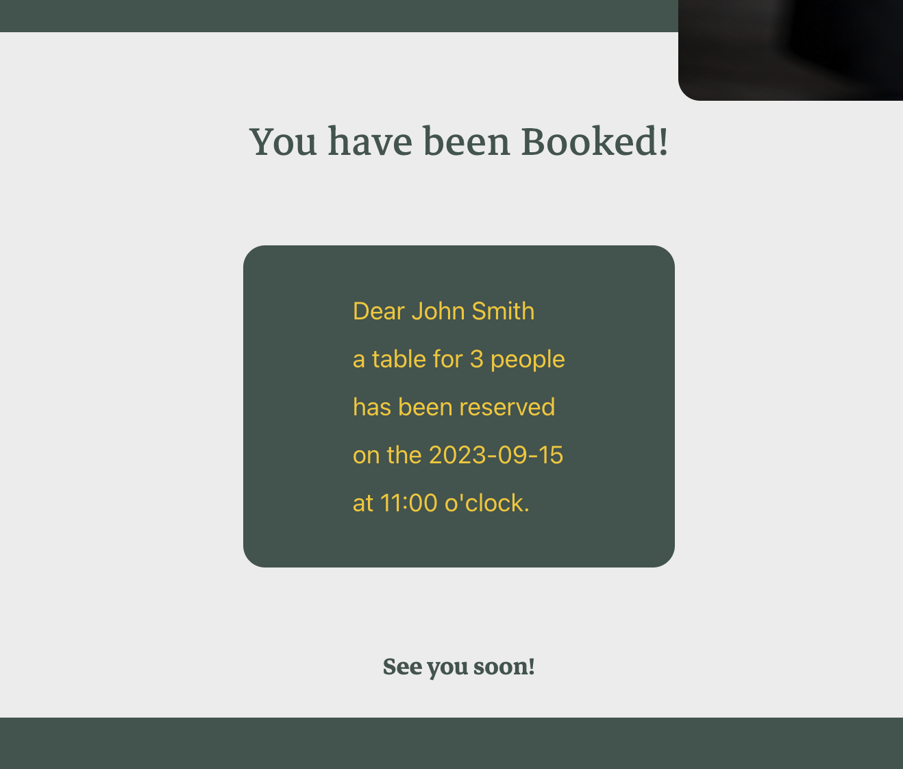

# Meta Frontend Certificate: Capstone Project

## What is it about?

This is the capstone project of the Meta Frontend Developer course provided on [Coursera](https://www.coursera.org/learn/meta-front-end-developer-capstone?specialization=meta-front-end-developer).

It is a website made to serve a pretend restaurant called "Little Lemon".

## Focus

Learn Frontend development implementing the UI/UX and logic.

## Technologies used

- UX
  - User Persona
  - User Journey
  - Heuristics
- UI
  - Figma
- HTML
  - semantic HTML
- CSS
  - CSS3
  - Flexbox
  - CSS Grid
- Javascript
- ReactJS
  - React Hooks
  - Formik (forms)
- Testing
  - Jest
  - React Testing Library
- Version Control
  - Git
  - GitHub

## Things I would do differently next time

- I didn't know it was possible to inherit the parent element's grid using `grid-template-columns: subgrid`.
  It would have made a lotof sense using it considering how extensively I have used grids in order to have the different sections lined up nicely
- Formik makes it easier to create responsive forms within a React project, however you have to hack your way around if you need to do something not straightforward and that caused problem during the testing phase
- You had to follow the project on how to implement the functionality; I sometimes found myself having implemented too many things and having to step back after watching/reading the next section. I suppose this would be similar to what could happen with a client, so in the future I would definetely make sure to reach ana greement on the requirements as soon as possible

## Why did I take this course in the first place?

- I had already used most of theese technologies in the past but I needed a refresher. The course offers a certificate of completion from Meta and it was supposed to allow you to apply to Meta's jobs portal.
- As React is developed by Meta I thought it would make sense to see the way they use that piece of technology
- I had never planned a project with Figma before, only used the very basics, I thought that learning how to use it wouldn't hurt

## Screeenshots

#### Planning

User Persona

User Journey

#### Figma

Wireframes

Prototypes

#### Website

